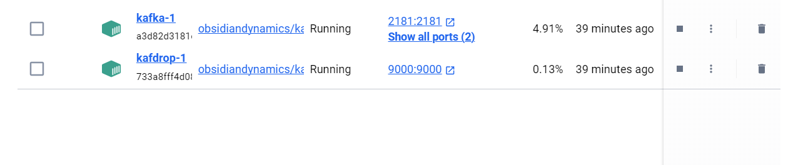
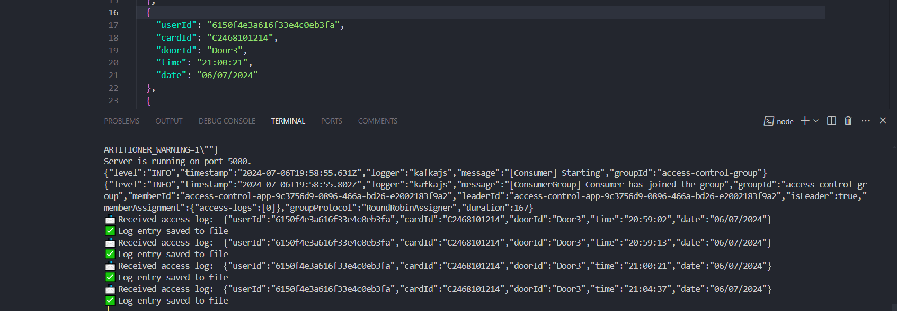
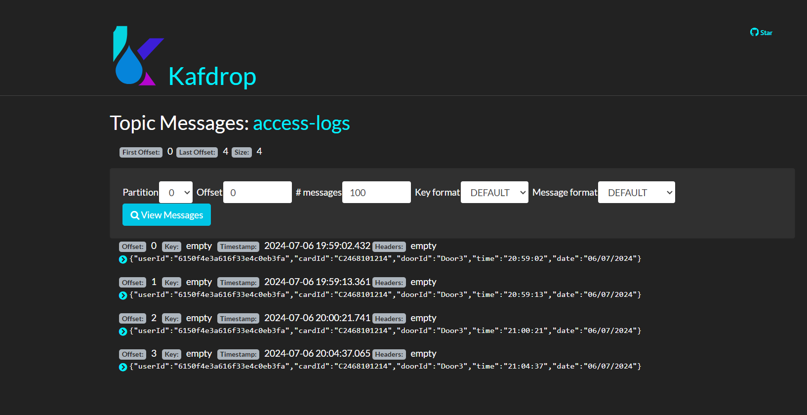

# Access Control System with Kafka Integration

This project implements an access control system that utilizes Kafka for real-time event streaming and local file storage for archival purposes.

## Overview

The system is composed of the following main components:

- **Express.js Server**: Acts as the backend server handling HTTP requests and integrating with Kafka for message production and consumption.
- **Kafka**: Used for message brokering between the server and consumers.
- **Local File System**: Stores access log data locally in JSON format for persistent storage and analysis.

## Components

### 1. Server (`index.js`)

The main server file sets up an Express.js application to handle incoming HTTP requests and integrates with Kafka for real-time message processing.

#### Dependencies

```json
{
  "dependencies": {
    "express": "^4.17.1",
    "body-parser": "^1.19.0",
    "kafkajs": "^1.18.0",
    "fs": "^0.0.1-security"
  }
}
```

#### Setup

1. **Installation**: Install dependencies using `npm install`.
2. **Run**: Start the server with `npm start`.

### 2. Kafka Configuration (`config.js`)

Configures a Kafka producer and consumer to manage access log messages.

## Usage

1. **Start Kafka and Zookeeper**: Use Docker Compose to start Kafka and Kafdrop for monitoring (`docker-compose up`).
   
3. **Run Server**: Start the server (`npm start`).
   
4. **Log Access**: Send POST requests to `/api/access` with JSON body containing `userId`, `cardID`, and `doorId` to log access events.
   
5. **JSON Data Format**:
   Access log data is stored and transmitted in JSON format. Below is an example of the JSON structure used for logging access events:
``` [
  {
    "userId": "6150f4e3a616f33e4c0eb3fa",
    "cardId": "C2468101214",
    "doorId": "Door3",
    "time": "20:59:02",
    "date": "06/07/2024"
  },
  {
    "userId": "6150f4e3a616f33e4c0eb3fa",
    "cardId": "C2468101214",
    "doorId": "Door3",
    "time": "20:59:13",
    "date": "06/07/2024"
  }
] ```
